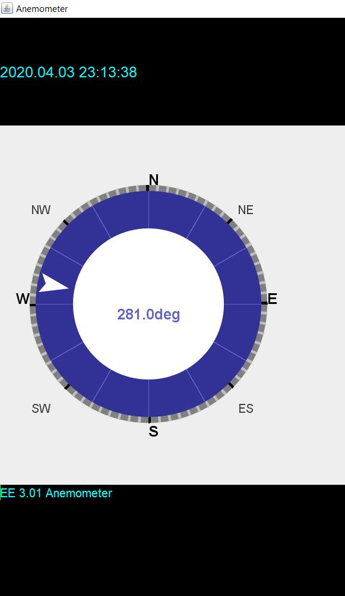

# EE322_Pro_Anemonmeter
### DESCRIPTION

This is a java swing user interface exapmle for display the direction. this UI was created for a part of a semester project and it has used java 2D Graphics. at this stage it is set to show all the direction while running through a loop in 0 to 360 degrees.

An image of the UI is showing on the figure bellow 

 

### LINKS
[Click here](https://github.com/DarshanaUOP/EE322_Pro_Anemonmeter/raw/master/out/artifacts/EE322_Pro_Anemonemeter_jar/EE322_Pro_Anemonemeter.jar) to download .jar file.
[Click here](https://github.com/DarshanaUOP/EE322_Pro_Anemonmeter/raw/master/out/artifacts/EE322_Pro_Anemonemeter_jar/setup%20anemometer.exe) to download windows installer.
